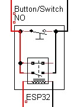
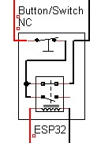
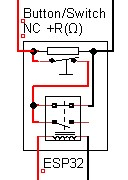

# Integration of ESP32 with relay

# Switch type

Depending on what type of switch you are trying to remote controll you will need slighty difrent wiering.

* Check what type of switch you are trying to remot control.
  * Is it normaly open (will it not let thru electrycity normaly)?
    * You need NO relay schematic.
  * Is it normaly closed (will it let thru electrycity normaly)?
    * You need NC relay schematic.
  * Dose it have any other component connected (like a resistor)?
    * You need corespondecnly NO or NC with R(Resistor).

### NO
For a normay open button you need to connect the relay in parallel as shown bellow.

### NC
For a normay closed button you need to connect the relay in series as shown bellow.

### NC Resistans
For a normay closed button you need to connect the relay in series as shown bellow and let the resistor go from befor the first button to after the last.

